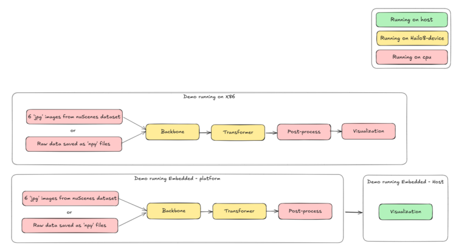

BEV Demo
========

This demo uses a Hailo-8 device with PETR to process 6 input images from nuScenes dataset.
It annotates these images with 3D bounding boxes and creates Bird's Eye View (BEV) representations.


<p xmlns:cc="http://creativecommons.org/ns#" xmlns:dct="http://purl.org/dc/terms/">
    <span property="dct:title">This gif uses images from <a href="https://www.nuscenes.org" target="_blank" rel="noopener noreferrer">nuScenes dataset</a>, and it</span> is licensed under
    <a href="https://creativecommons.org/licenses/by-nc-sa/4.0/?ref=chooser-v1" target="_blank" rel="license noopener noreferrer" style="display:inline-block;">CC BY-NC-SA 4.0
        
        
        
        
    </a>
</p>


Pipeline
--------



Requirements
------------

- hailo_platform==4.18.0
- Pyhailort - Enable hailort service
- mmdet3d.datasets 


Usage
-----

1. Clone the repository:
    ```shell script
    git clone https://github.com/hailo-ai/hailo-BEV.git
            
    cd BEV_Demo
    ```

2. Install dependencies:
    ```shell script
    pip install -r requirements.txt
    ```

3. Download demo resources:
    ```shell script
    ./download_resources.sh
    ```

4. Data creation:
    - Download the full dataset from https://www.nuscenes.org/nuscenes#download

5. Visualize results:
    To visualize results without running inference, use the following command:
    ```shell script
    ./src/visualize_results.py
    ```

    Arguments:

    ``-f, --file``: scene data file path.

    For more information:
    ```shell script
    ./src/visualize_results.py -h
    ```
    Example:

    ```shell script
    ./src/visualize_results.py -f resources/results/scenes_data.json
    ```

Run Inference
-------------

1. Cloning PETR repository:
    ```shell script
    git clone https://github.com/megvii-research/PETR.git && cd PETR && git checkout f7525f9
    ```

2. Pickle creation:
    - To generate a pickle file for sweep data using the generate_sweep_pkl.py script from the PETR GitHub repository - 
    https://github.com/megvii-research/PETR/blob/main/tools/generate_sweep_pkl.py

3. Data preparation:
    To prepare your data using the data_preparation script:
    - Update Paths: Update all paths in the data_preparation.py script file to match your environment.

        ```shell script
        ./src/data_preparation.py -p <path to the PETR folder> -c <path to config_file.py>
        ```
    - Upon completion of the script, you will find .pt files generated as a result of the data preparation process.

4. Run inference: 
    ```shell script
    ./src/bev.py -m <model_path> -i <input_path> -d <data_path> -f <wanted_FPS> --infinite-loop -n <number_of_scenes>
    ```
    For optimal visibility of 3D boxes, aim for an FPS range of 1 to 4. Higher FPS values might hinder clear observation, given that nuScenes samples were captured at 2 FPS. Higher FPS settings can create an illusion of faster vehicle movement.

Arguments
---------
- ``-f, --fps``: Wanted FPS (1 - 9). 
- ``--infinite-loop``: Run the demo in infinite loop.
- ``-i, --input``: path to the input folder, where all the .pt files are.
- ``-m, --models``: path to the models folder.
- ``-d, --data``: path to the data folder, where the nuScenes dataset is.
- ``-n, --number-of-scenes``: number of scenes to run.

For more information:
```shell script
./src/bev.py -h
```
Example 
-------
**Command**
```shell script
./src/bev.py --fps 5 -n 2
```

Additional Notes
----------------
- The demo was only tested with ``HailoRT v4.18.0``
- Ran the demo on: Dell PC (Model: Latitude 5431), with CPU (Model: 12th Gen Intel(R) Core(TM) i7-1270P).
- All data is computed at runtime, except of the map, which is derived from the ground truth.

License
----------
The BEV Demo is released under the MIT license. Please see the https://github.com/hailo-ai/hailo-BEV/LICENSE file for more information.


Disclaimer
----------
This code demo is provided by Hailo solely on an “AS IS” basis and “with all faults”. No responsibility or liability is accepted or shall be imposed upon Hailo regarding the accuracy, merchantability, completeness or suitability of the code demo. Hailo shall not have any liability or responsibility for errors or omissions in, or any business decisions made by you in reliance on this code demo or any part of it. If an error occurs when running this demo, please open a ticket in the "Issues" tab.

This demo was tested on specific versions and we can only guarantee the expected results using the exact version mentioned above on the exact environment. The demo might work for other versions, other environment or other HEF file, but there is no guarantee that it will.